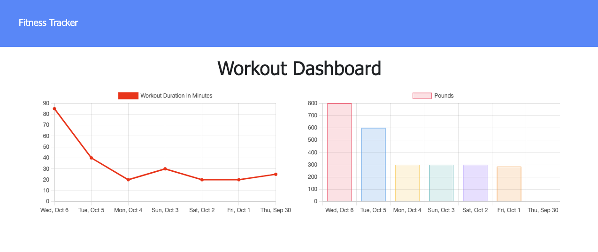

# Workout Tracker

  ## Table of Contents
  * [Description](#description)
  * [Technologies Used](#technologies-used)
  * [Installation](#installation)
  * [Usage](#usage)
  * [Contributing](#contributing)
  * [Questions](#questions)

  ## License 
This project is covered under the MIT License.
    
  
  
  Click on the badge to see **MIT License** details.

  ## Description
  Exercise application that keeps track of previous workout statistics, as well as creating new workouts and exercises.

  See the [live application](https://boiling-garden-95289.herokuapp.com/)

  

  ## Technologies Used

  - MongoDB
  - Mongoose
  - Express.js
  - Node.js
  - JavaScript
  - HTML
  - CSS

  ## Installation
  Clone the repository and set it up on your local machine.  Run 'npm install'.

  ## Usage
  Use when getting serious about starting an exercise routine.

  ## Contributing
  Send me a message about how you would like to contribute.

  ## Questions
  
  [github.com/jeffMullen](https://github.com/jeffMullen)

  If you have additional questions, feel free to reach me at jeffmullendev@gmail.com
